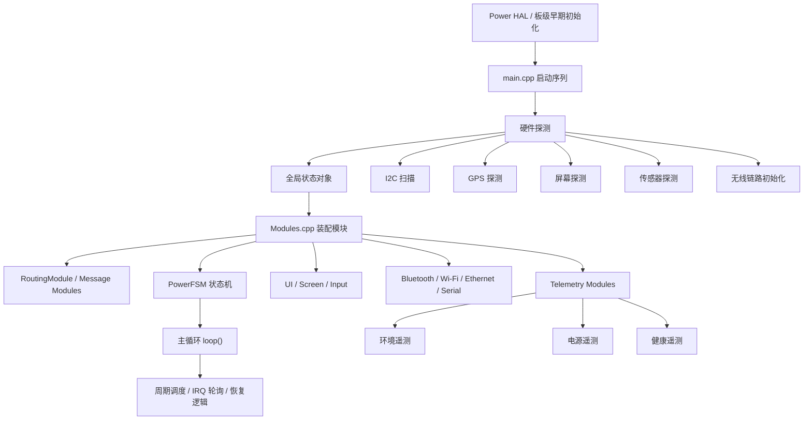
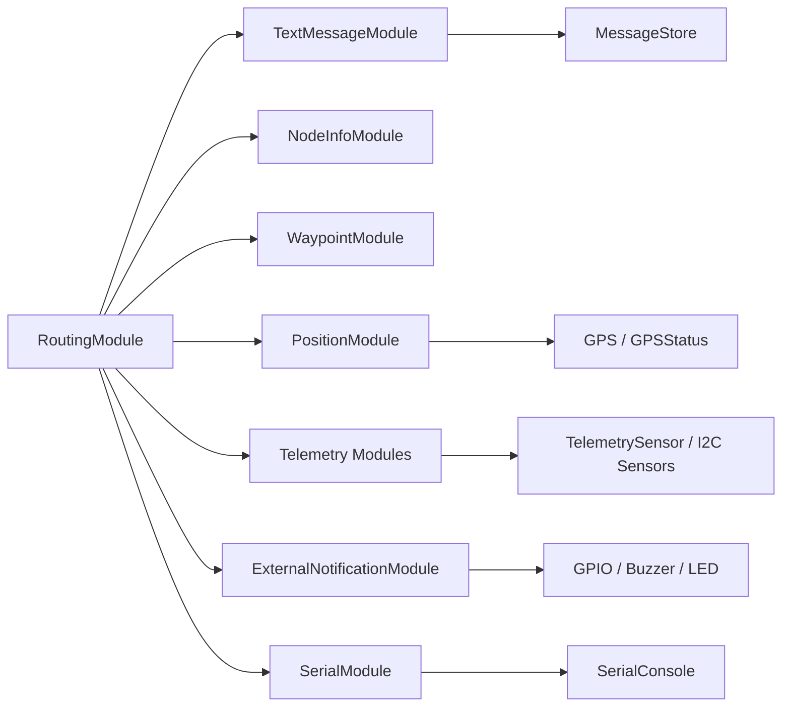

# 系统架构与时序说明

> 文档定位：本文档用于描述系统如何启动、模块如何协作以及数据如何流动，重点通过图示呈现整体结构。

## 1. 总体架构



### 结构解释

- `src/main.cpp` 是总入口，负责把“板子先点亮，再让系统活起来”。
- `src/modules/Modules.cpp` 负责把功能模块按条件创建出来。
- `src/PowerFSM.cpp` 负责电源状态和睡眠策略。
- `variants/` 决定某块板子的引脚、电源、屏幕和外设差异。
- `boards/` 保存大量板级构建定义，供 PlatformIO 和变体引用。

## 2. 启动时序

```mermaid
sequenceDiagram
    participant Boot as Boot
    participant Main as main.cpp
    participant Variant as variant.cpp
    participant Power as Power HAL
    participant Detect as HW Detect
    participant Modules as Modules.cpp
    participant FSM as PowerFSM
    participant Loop as loop()

    Boot->>Main: 进入 setup()
    Main->>Power: powerHAL_init()
    Main->>Power: waitUntilPowerLevelSafe()
    Main->>Variant: earlyInitVariant()
    Main->>Detect: 配置引脚 / 初始化外设
    Main->>Detect: 扫描 I2C / 屏幕 / GPS / 无线
    Main->>Modules: setupModules()
    Main->>FSM: PowerFSM_setup()
    Main->>FSM: new PowerFSMThread()
    Main->>Loop: 进入主循环
    Loop->>FSM: 周期检查 / 事件触发
    Loop->>Modules: service->loop()
```

### 时序原则

- 早期电源初始化必须最先执行。
- 变体初始化优先于任何依赖板级资源的外设操作。
- 模块注册在配置和硬件探测之后。
- 状态机负责“睡眠和供电策略”，主循环负责“持续调度”。

## 3. 模块关系



### 关系说明

- 路由层是消息分发中心。
- 各业务模块只处理自己关心的消息类型。
- 遥测模块依赖传感器发现和配置开关。
- UI、串口和通知属于输出侧，不应反向污染核心协议层。

## 4. 关键约束

- `RoutingModule` 必须最后创建。
- 状态机切换要考虑屏幕、蓝牙和供电的连带副作用。
- 变体代码不应直接承担业务逻辑。
- 任何新增模块都要考虑是否会影响构造顺序和全局单例依赖。

## 5. 相关文档

- [`docs/README.md`](/Users/bh4me_macair/Documents/Codex/mecho_f/docs/README.md)
- [`docs/index-zh.md`](/Users/bh4me_macair/Documents/Codex/mecho_f/docs/index-zh.md)
- [`docs/logic-spec.md`](/Users/bh4me_macair/Documents/Codex/mecho_f/docs/logic-spec.md)
- [`docs/terminology.md`](/Users/bh4me_macair/Documents/Codex/mecho_f/docs/terminology.md)
